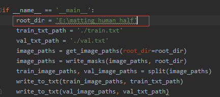

# deep_image_matting
+ ## 操作手册
  1. 环境说明
    + 工程的技术用的是pytorch
    + 需要导入的包:
        + python3.7 
        + torch 1.3.1 torchvision 0.4.2  （GPU版，1.0+pytorch即可）
        + tensorflow（任意版本，支持tensorboard即可）
        + pillow 6.0.0(pillow 6.0.0需要降到7.0.0以下版本，否则torchvision会报错)
  2. 操作顺序
    + 运行 data/retrieve.py 图片预处理的类
        + 超参设定:只需要设定好训练数据的地址(main方法中的root_dir)
            + 
    + 运行 train.py 训练(300epoch,本机是1050的笔记本显卡,训练了24小时不到,速度还不错) 
        + 超参设定:所有的超参都是在这个对象中,需要导入包
        parser = argparse.ArgumentParser(description='Train deep image matting model.')
            + 
    + 运行 predict.py 测试(预测): 
        预测暂时只能预测作者已有的test集,自己的图片无法测试,研究中 __(todo)__
  3. 其它补充
    + 训练好之后model 文件会保存在 models/model.ckpt
    + tensorboard 文件也在model/logs
+ ## 类说明
  1. data/retrieve.py
    + 预处理图片,将图片分门别类
  2. train.py
    + 网络结构用的vgg16的13conv,结构如下
        + 
    + 梯度用的是adam的方法,加速收敛
    + (alphas是标签? __todo__ )
  3. predict.py与predict_trimap.py(待研究)
+ ## 问题说明
    + 环境问题
        + pytorch的cuda版有很多安装问题,初期安装遇到有如下三个问题
            + cuda版本的 torch 和 torchvision 版本不兼容,原因:pytorch的torch,torchvision必须对应,否则版本不兼容.(百度查询直接在清华源下载)
            + numpy中的一个子类pillow和pytorch不兼容(pillow 6.0.0需要降到7.0.0以下版本，否则torchvision会报错),
            找到6.0.0这个版本最为稳妥(网上直接下载whel文件然后pip直接安装)
            + cuda版本显卡对应(cuda版本需要对应本地显卡的型号,还有设置好环境变量)
    + 运行问题
        + data/retrieve.py
            + 这个是预处理图片数据的类,超参设定正确即可
        + train.py
            + 很多超参设定的问题,主要有以下几个问题:
                1. parser.add_argument('--gpu_indices', default=[0], type=int, nargs='+',
                help='The indices of gpus to be used.')
                2. parser.add_argument('--batch_size_per_gpu', default=1, type=int,
                    help='Batch size of one gpu.')
                这两个都是gpu设置问题,第一个是设置gpu集群,初始设置的是1,但是本地的gpu只有一块,并且gpu的id默认是
                从0开始(当时搞了好久,最后是在cmd中nvdia-smi命令查看显卡信息才设置好)
                第二个是设置gpu训练的批次数量,默认设置成32(本机比较差,使用的时候用32的batch会导致gpu爆掉,所以设置成1,显卡好的同学可以设置的高一点)
                3. 
+ ## 未解决问题
    1. train.py中的问题
        + 
        四个参数images,alphas,alphas_noise,masks  
        按照字面意思,图片,alphas,alphas噪音,未知区域?(待研究)
    2. 核心的loss函数未搞明白(主要也是上述的4个参数代表的含义没搞明白)
        + 
    3. 预测集predict.py与predict_trimap.py
        + 无法使用自己的数据去预测,目前只能使用作者的test集

+ ## tensorboard 效果图集合        
